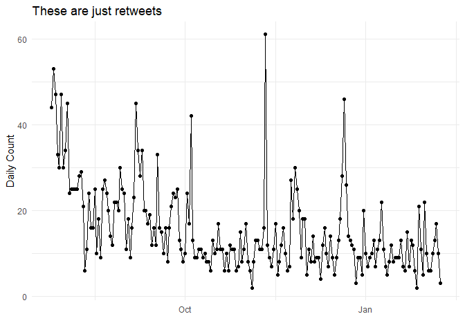

This is just to say
================
Ethan Christensen
February 9, 2019

## Introduction

William Carlos Williams is one of my favorite poets. He is able to
create incredible visuals with very few words, and it feels very
accessible to me. One of his most famous works is his 1934 poem “This is
just to say”:

> I have eaten
> 
> the plums
> 
> that were in
> 
> the icebox
> 
>  
> 
> and which
> 
> you were probably
> 
> saving
> 
> for breakfast
> 
>  
> 
> Forgive me
> 
> they were delicious
> 
> so sweet
> 
> and so cold

This poem gained new life on the internet in 2018, with lots of
repostings and parodies appearing across various forms of social media.
As a fun project, Twitter users @mellymeldubs and @johnrladd created a
bot account (@sosweetbot) that retweet posts that contained elements of
the poem or referenced it (for example by using both the words plum and
icebox). I thought that it would be an interesting activity to use the
retweet history of this bot to look at the poem’s online popularity over
time. I also thought that it would be interesting to see if there are
trends in how the poem is altered. Prior to starting this project, I had
seen a number of variants of the poem that referenced various political
events of the day/week. I wrote a version myself that referenced
instruments for IV regression.

## Data

The first thing was to acquire the timeline history of the @sosweetbot
account. I did this using the `rtweet` package by Mike Kearney
(@kearneymw).

``` r
#Load the package
library(rtweet)
```

    ## Warning: package 'rtweet' was built under R version 3.5.2

``` r
#create the token - note that these are not my actual keys
create_token(
  app = "Fake app name",
  consumer_key = "KelfkgOIU098elktj09vFShklgjvb98",
  consumer_secret = "304598voiuSDKER095435oiuLKI09845kjhwer83hHDSE8456",
  access_token = "239857w-wkvjhkwjr938958wrefksdjhk4598fsjher3kj43ktjh",
  access_secret = "eriocu-95343498gdvuhdfkj4tdfyv98yjhv85lj65iour")
```

    ## <Token>
    ## <oauth_endpoint>
    ##  request:   https://api.twitter.com/oauth/request_token
    ##  authorize: https://api.twitter.com/oauth/authenticate
    ##  access:    https://api.twitter.com/oauth/access_token
    ## <oauth_app> Fake app name
    ##   key:    KelfkgOIU098elktj09vFShklgjvb98
    ##   secret: <hidden>
    ## <credentials> oauth_token, oauth_token_secret
    ## ---

For safety purposes, I’m not putting my actual token details online. I
source the token from a file covered by my `.gitignore`

``` r
#pull in my true token: note that this is not uploaded to github.
source(twitter_token.R)
```

Because I am pulling only from a specific account I am limited by the
Twitter API on the number of tweets I can capture. That said, I can
still pull over half of all of the tweets from the start of the account.

``` r
#The code I ran to get my tweets
#Note that this won't run unless eval = TRUE in real_token chunk
sosweet <- get_timelines("sosweetbot", n = 3124)
```

I am going to use the tweets I scraped on February 8, 2019. This dataset
contains all retweets back to July 25, 2018. I would like to keep adding
new tweets periodically, but I haven’t decided how to do so
methodically.

``` r
sosweet <- readRDS("sosweetweets.RDS")
```

So now I have my delicious tweets. How often do people quote my man WCW?

``` r
sosweet %>%
  ts_plot("days, trim = 1L") + 
    geom_point() + 
      theme_minimal() + 
        labs( x = "", y = "Daily Count", title = "These are just retweets")
```

<!-- -->

It appears that there are a handful of points where WCW becomes very
popular, we want to check those out\!

## Future work\!

  - Separate out the full-fledged poems from references to the poem that
    the bot also catches
  - Find what non WCW words are commonly added
  - Make sure all packages used are visible
